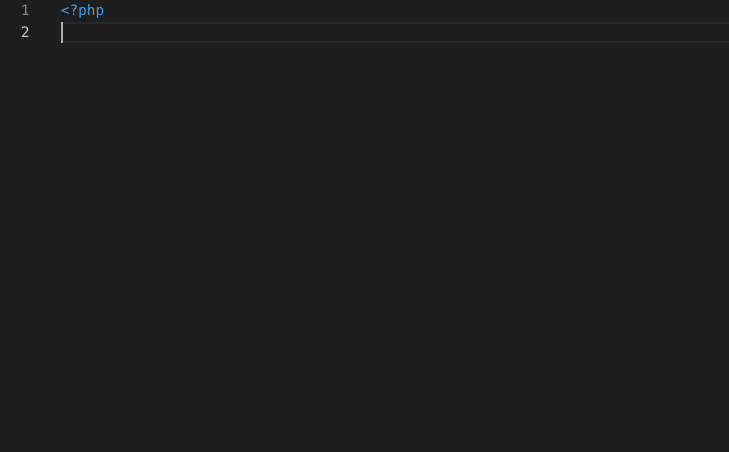
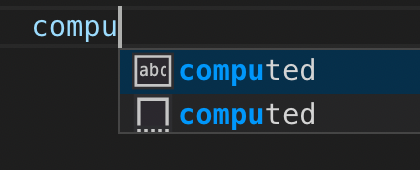

# Atom Snippets

Code snippets for Atom in order to let you develop faster. 

为以下开发提供代码片段自补全功能:

- [Atom](http://atom.baidu-int.com/atom-web)
- [AtomEngine](http://atom.baidu-int.com/atom-native)
- [NextPage](http://superframe.baidu.com/support/next-page/)

(新版本提供了语言定义, Snippets功能不再依赖Mota插件)

默认Tab键触发

## Features

- 支持Atom语法高亮
- 提供Atom常用组件、属性等Snippets功能
- 提供smarty、php预处理文件Ala全部API的Snippets功能
- 提供AtomEngine全部组件、通用属性、通用事件、生命周期等Snippets功能
- 底部状态栏提供按钮调起终端及快速同步到测试机(atom、nextpage)/启动调试(atom-engine)并输出日志
- 快捷键（⌘+.）或右键文本中菜单栏Soy跳转到索引平台(暂定)

### Demo-atom补全
<!--  -->


### Demo-php补全
<!--  -->


## Snippets available

### Atom
提供开发模板

prefix:

- `ll`
    - 开发模板: template/script/style标签组
- `lconfig`
- `lscript`
- `lstyle`
- `lstyle-less`


### Atom组件
目前支持c-aladdin等47个atom组件

atom/prefix:

- `ll`
    - {{ }} 文本插值
- `component`
- `template`
- `caladdin`
- `ctitle`
- `cline`
- `cline2`
- `cimgcontent`
- `cimgcontents`
- ......

atom-engine/prefix:

- `view`
- `text`
- `image`
- `webview`
- `viewpager`
- `scrollview`
- `h-scrollview`
- `photo`
- `video`
- `@click`
- `@tap`
- `@focus`
- `@touchstart`
- `@touchend`
- `@touchmove`
- `@scroll`

### 常用属性
prefix:

- `ref`
- `class`
- `style`
- `url`
- `params`
- `title`
- `data-module`

### 注释
prefix:

- `htmlcs-disable`
- `htmlcs-enable`

### filter
支持filter拼sf/mip..

prefix:

- `|sf`
- `|mip`
- `|vsearch`

### Smarty
支持Ala全部Smarty API，常用Smarty语法及变量、代码块

p.s. c前缀为防止与其他框架冲突, 后续增加对smarty语法高亮后取消

prefix:

- `ll`
    -  定界符
- `data`
    - $tplData
- `cprint`
    - 打印数据, 用于文件尾
- `cif`
- `cifelse`
- `cforeach`
- `ifempty`
- `ifisset`
- `empty`
- `isset`
- `tclink`
- `sflink`
- `miplink`
- `vsearchlink`
- `timglink`
- `tplinfo`
- `formatdate`
- `timespan`
- `highlight`
- `httpshost`

### PHP
支持Ala全部PHP API，常用PHP语法及变量、代码块

p.s. c前缀为防止与其他框架冲突, 后续增加对php语法高亮后取消

prefix:

- `data`
    - $tplData
- `datall`
    - $tplData[' ']
- `ll`
    - [' ']
- `cprint`
    - 打印数据, 用于文件尾
- `cif`
- `cifelse`
- `cforeach`
- `ifempty`
- `ifisset`
- `tclink`
- `sflink`
- `miplink`
- `vsearchlink`
- `timglink`
- `httpshost`
- `highlight`
- `tplinfo`
- `searchlink`
- `formatdate`
- `timespan`
- `templatevars`

### JS
支持少量js语法及生命周期函数

prefix:

- `clog`
    - console.log
- `cif`
- `cifelse`
- `cfunction`
- `cswitch`
- `computed`
- `beforeCreate`
- `created`
- `beforeMount`
- `preMounted`
- `mounted`
- `beforeUpdated`
- `updated`
- `beforeDestroy`
- `destroyed`
- `computed`

## Plans

- 对php/smarty提供语法高亮
- 提供颜色主题选择
- 对全部Atom组件的snippets功能支持
- 鼠标悬停+快捷键等显示说明or跳转文档
- nextpage引用组件文件跳转
- prop/data数据模板内sinppets
- 引用组件/数据模板内未使用的提示处理
- 模板内使用组件未引用等提示处理

## Common Issues
- atom中使用vscode内置插件emmet语法

    修改emmet语言映射

    ```json
    "emmet.includeLanguages": {
        "atom-html": "html",
        "atom": "html"
    }
    ```

- nextpage 代码自补全功能不生效

    修改setting.json用户设置配置语言文件关联

    ```json
    "files.associations": {
        "*.atom.html": "atom"
    }
    ```

- vscode自带word预测优先级高于sinppets

    
    <!--  -->

    设置取消预测, 将snippets优先级设置最高

    ```json
    "editor.wordBasedSuggestions": false,
    "editor.snippetSuggestions": "top"
    ```
